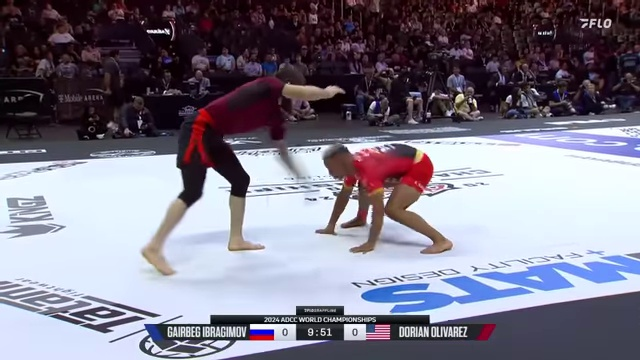
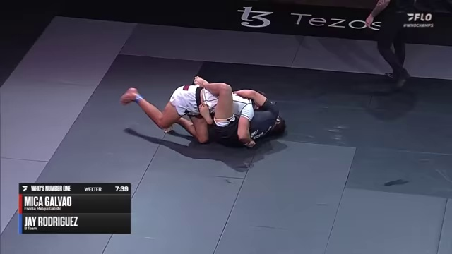
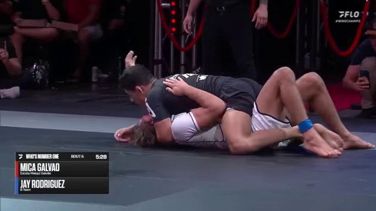
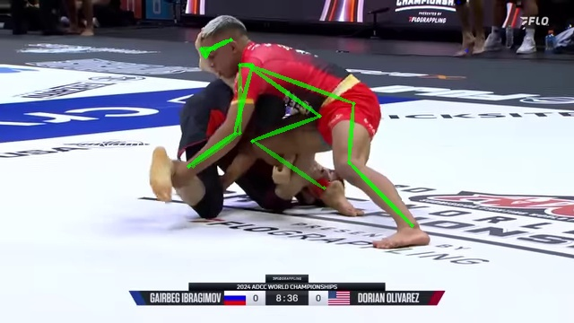
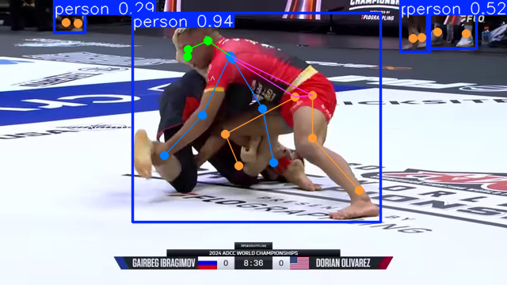
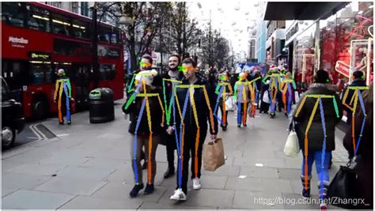
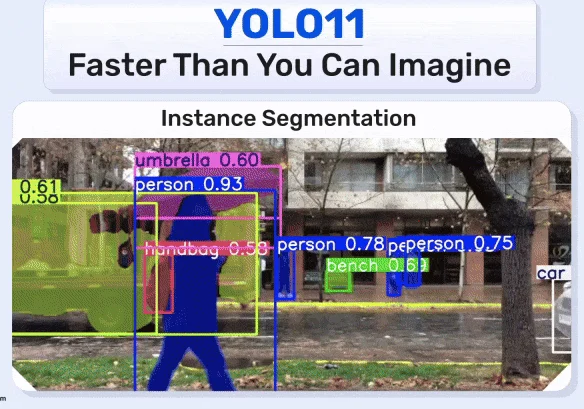

I need to be able to retrieve jiu jitsu film for 3 general battles that happen in the sport. I am sorry if I offend any jiu jitsu practicioners with these definitions. Email me if you disagree. Or text me if you have my number :).
1. Standing Battle
- When both opponents are on a foot or knee, moving to take the other opponent to the ground.
- 
2. Guarded Battle
- When one opponent is seated or supine with their legs in front of the other opponent.
- 
3. Pinning Battle
- When one opponent is past the other opponent's legs.
- 

## Progress so far
- I started with gathering various matches I could find on youtube and splitting the videos up into frames of each second of the match. I ended up with 12,000 frames. I proceeded to annotate each frame with 1 of the 4 classes: standing, pinning, guarded, none. I got to 4,000 annotated frames before deciding to test it on my custom CNN. [Data Collection and Annotation Jupyter Notebook](https://github.com/AndrewstheBuilder/VideoSemanticSearch_JiuJitsu/blob/main/LabelData_VideoSemanticSearch_JiuJitsu.ipynb)
- I got 53% on my testing dataset which is better than random guessing so the classifier is learning something. The confusion matrix at the end of this notebook showed that a lot of guarded predictions are actually pinning which makes sense since those two positions are closely linked. The only difference is if the seated or supine opponent's legs are in front of the other opponent. [CNN Training/Evaluating Jupyter Notebook](https://github.com/AndrewstheBuilder/VideoSemanticSearch_JiuJitsu/blob/main/CNN_JiuJitsu_Film.ipynb)
- From there I decided that we need to use a pose estimation tool to help the network find and link the relativities of the limbs of both players to the 3 situational battles. For this I decided to use Alpha Pose and it had trouble putting bounding boxes on two jiu jitsu players that were attached to each other. The neural network did not understand that it was seeing two different people and just assumed it was one person. I also had a difficult time setting up Alpha Pose and had to clone it and make changes to it and use my own version to actually get it working. This was before I realized that the newer Yolo models Yolov7-v11 has pose estimation built in to it. And its newer and better than AlphaPose. [Alpha Pose Jupyter Notebook](https://github.com/AndrewstheBuilder/VideoSemanticSearch_JiuJitsu/blob/main/alphapose_collab.ipynb)
  - 
    - AlphaPose Estimation
- I also tried the most advanced YoloV11 model and ended up with similar results. The network could not distinguish that it is seeing two different people. [Yolo V11 Jupyter Notebook](https://github.com/AndrewstheBuilder/VideoSemanticSearch_JiuJitsu/blob/main/yolo11_collab.ipynb)
  - 
    - YoloV11 Pose Estimation
- I think AlphaPose is actually better than YoloV11 since YoloV11 is more of a general purpose object detecter while AlphaPose is specifically designed for pose detection. YoloV11 is a single step architecture for pose detection though it is not using multiple networks(steps) to do pose estimation like AlphaPose. AlphaPose uses Yolov3 for detecting bounding boxes then its using a resnet for pose estimation.
  - The benchmarks show...
- I think I want to train a model to specificly detect poses on jiu jitsu players. It seems like models do not have this in their training sets and they should because there are a lot of interesting cases of occlusion there. I have the intuition that I can train a neural network to do pose estimation for jiu jitsu specific occlusion cases because of outputs like these for AlphaPose and YoloV11:
  - 
    - AlphaPose
  - 
    - YOLOv11
- See if it can handle these complicated situations of occlusion above then it can handle my jiu jitsu scenarios.
